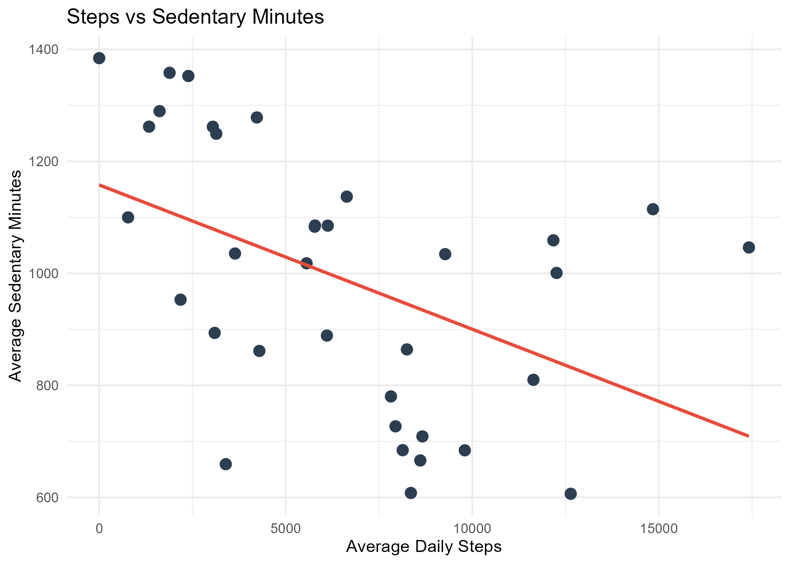

```{r setup, include=FALSE}
knitr::opts_chunk$set(echo = TRUE)
```
# Introduction
This case study explores smart device usage patterns using Fitbit data to inform Bellabeat’s product marketing strategy. The analysis covers user activity, sleep, calorie burn, and heart rate trends, with actionable insights for Bellabeat’s Leaf, Time, Spring, and App offerings.


# 📊 Visual: Steps vs. Sedentary Minutes

```{r steps-vs-sedentary, out.width="80%", fig.align="center"}


```

```{r process-overview, echo=FALSE, message=FALSE}
library(tibble)
library(knitr)

workflow_steps <- tribble(
  ~Step, ~Summary,
  "Ask", "Define business task: analyze smart device usage",
  "Prepare", "Assess Fitbit dataset, ensure reproducibility",
  "Process", "Clean datasets using modular R scripts",
  "Analyze", "Aggregate user-level metrics",
  "Visualize", "Create portfolio-ready plots",
  "Share", "Deliver strategic insights",
  "Act", "Package findings into case study"
)

kable(workflow_steps, caption = "Bellabeat Case Study Workflow", align = "l")
```
```{r load-summary, echo=FALSE, message=FALSE}
summary_df <- read.csv("../Outputs/analyze_combined_summary.csv")
```
```{r avg-steps, echo=FALSE}
library(knitr)

kable(
  data.frame(Average_Steps = summary_df$avg_steps),
  caption = "📊 Average Daily Steps"
)
```
```{r sedentary-minutes, echo=FALSE}
kable(
  data.frame(Sedentary_Minutes = summary_df$avg_sedentary),
  caption = "🪑 Average Daily Sedentary Minutes"
)
```
```{r sleep-duration, echo=FALSE}
kable(
  data.frame(Sleep_Hours = summary_df$avg_sleep),
  caption = "😴 Average Sleep Duration"
)
```
```{r heart-rate, echo=FALSE}
kable(
  data.frame(Avg_Heart_Rate = summary_df$avg_hr),
  caption = "❤️ Average Heart Rate"
)
```
```{r key-findings-table, echo=FALSE, message=FALSE}
library(knitr)

key_metrics <- data.frame(
  Metric = c("Average Daily Steps", "Sedentary Minutes", "Sleep Duration (hrs)", "Average Heart Rate (bpm)"),
  Value = c(
    summary_df$avg_steps,
    summary_df$avg_sedentary,
    round(summary_df$avg_sleep, 1),
    round(summary_df$avg_hr, 1)
  )
)

kable(key_metrics, caption = "📌 Key Findings from Fitbit Usage Data", align = "l")
```
```{r compute-key-averages, echo=FALSE, message=FALSE}
library(dplyr)

key_summary <- summary_df %>%
  summarise(
    `Average Daily Steps` = round(mean(avg_steps, na.rm = TRUE), 0),
    `Sedentary Minutes` = round(mean(avg_sedentary, na.rm = TRUE), 0),
    `Sleep Duration (hrs)` = round(mean(avg_sleep, na.rm = TRUE), 1),
    `Average Heart Rate (bpm)` = round(mean(avg_hr, na.rm = TRUE), 1)
  )
```

**Insight:** Users averaged `r summary_df$avg_steps` steps/day — below the recommended 10,000.
---